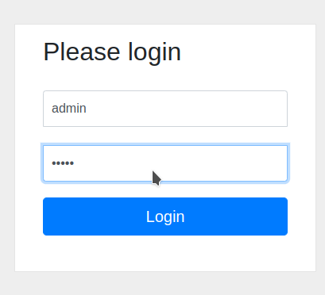
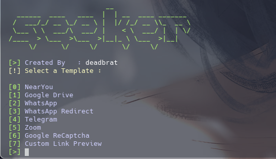

# 🌐 AccessX_Dev  
### Controlled Web-Based Vulnerability Assessment System

<p align="center">
  
  
  
</p>

<p align="center">
  <b>Web Engineering Final Year Project</b><br/>
  Secure System Design • Ethical Cybersecurity • Controlled Exposure
</p>

---

## 📌 Project Overview

**AccessX_Dev** is a **controlled cybersecurity engineering system** that integrates existing device analysis and reconnaissance tools into a **PHP-based web platform**.  
The system is designed strictly for **academic, ethical, and authorized demonstrations**, emphasizing **Web Engineering principles** rather than offensive security usage.

This project demonstrates how **powerful backend security tools** can be responsibly engineered into a **web-based architecture** with controlled access, auditing, and ethical safeguards.

---

## 🎯 Academic Focus

This project explicitly differentiates between:

- **Web Development**
  - UI design
  - Dashboards
  - Reporting interfaces

- **Web Engineering**
  - System architecture
  - Backend service integration
  - Security workflows
  - Ethical & legal constraints
  - Controlled deployment strategy

---

## 🧩 System Architecture (High-Level)

```mermaid
flowchart TD
    A[Authorized User] --> B[Web Interface]
    B --> C[PHP Backend Controller]
    C --> D[Access Control & Validation]
    D --> E[Security Analysis Services]
    E --> F[Local Database]
    F --> G[Dashboard & Reports]
