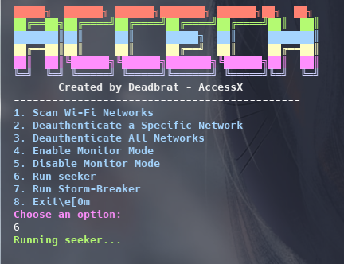
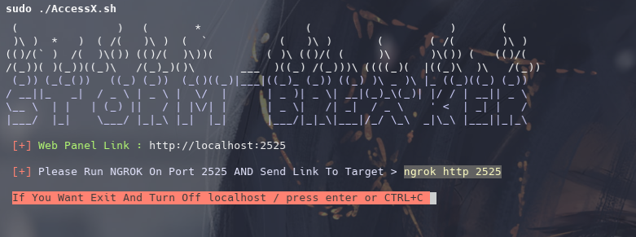

# 🌐 AccessX – Cyber Recon & Phishing Framework

<!-- Image Gallery -->
<p align="center">
  
  
  
  
  
  
</p>


**All-in-One Ethical Security Testing Suite** – Complete package with Seeker, Strombreaker, and Ngrok integration

---

## ⚙️ Launch from ANY terminal:

```bash
accessx  # Launches main interface


```mermaid
pie
    title Feature Distribution
    "Automated Phishing Templates" : 35
    "Device Fingerprinting" : 25
    "Real-time Tracking" : 20
    "Ngrok Integration" : 15
    "Cross-Platform" : 5


```mermaid
flowchart TD
    A[Start] --> B{Choose Module}
    B -->|Seeker| C[Track Devices]
    B -->|Strombreaker| D[Phishing Simulation]
    C & D --> E[Generate Link]
    E --> F[Share with Target]
    F --> G[Collect Data]


🚀 Instant Setup & Launch
bash
Copy
Edit
# Linux/macOS (System-wide install)
git clone https://github.com/rakibhassan66/AccessX.git
cd AccessX && sudo ./install.sh
powershell
Copy
Edit
# Windows (Run in PowerShell as Admin)
iwr -useb https://bit.ly/accessx-win | iex
👨‍💻 Developed by Rakib Hassan
🔐 Empowering Ethical Hackers & Security Researchers